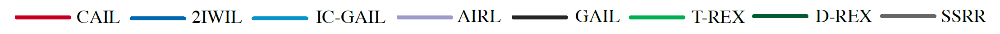

# Confidence-Aware Imitation Learning

[](https://sites.google.com/view/cail/) [](https://arxiv.org/abs/2110.14754)

Official implementation of the NeurIPS 2021 paper: [S Zhang](https://syzhang092218-source.github.io), [Z Cao](https://caozhangjie.github.io/), [D  Sadigh](https://dorsa.fyi), [Y Sui](https://www.yanansui.com/): "[Confidence-Aware Imitation Learning from Demonstrations  with Varying Optimality](https://sites.google.com/view/cail/)".

<center>
    
    <br>
    <div align="center">
        Figure 1: Framework of CAIL.
    </div>
</center>

## Dependencies

You need to have the following libraries with [Python3](https://www.python.org/):

- [MuJoCo](http://www.mujoco.org/) (This should be installed first)
- [Matplotlib](https://matplotlib.org/)
- [NumPy](https://numpy.org/)
- [Gym](https://gym.openai.com/)
- [tqdm](https://tqdm.github.io/)
- [PyTorch](https://pytorch.org/)
- [TensorBoard](https://www.tensorflow.org/tensorboard)
- [mujoco_py](https://github.com/openai/mujoco-py)
- [SciPy](https://scipy.org/)
- [pandas](https://pandas.pydata.org/)

To install requirements:

```bash
conda create -n cail python=3.6
conda activate cail
pip install -r requirements.txt
```

Note that you need to install [MuJoCo](http://www.mujoco.org/) on your device first. Please follow the instructions in [mujoco-py](https://github.com/openai/mujoco-py
) for help.

## Install

Install CAIL: First clone this repo, then run

```bash
pip install -e .
```

## Run

### Hyper-parameters

To train an expert or an Imitation Learning algorithm that reproduces the results, you can use the hyper-parameters we provided in ` ./hyperparam.yaml`.

### Train experts

To train experts, we provide algorithms including Proximal Policy Optimization (PPO) [[5]](#references) and Soft Actor-Critic (SAC) [[6]](#references). Also, we provide some well-trained experts' weights in the `./weights` folder. The file name means the number of steps the expert is trained. 

For example, you can use the following line to train an expert:

```bash
python train_expert.py --env-id Ant-v2 --algo ppo --num-steps 10000000 --eval-interval 100000 --rollout 10000 --seed 0
```

After training, the logs will be saved in folder `./logs/<env_id>/<algo>/seed<seed>-<training time>/`. The folder contains `summary` to track the process of training, and `model` to save the models.

### Collect demonstrations

First, create a folder for demonstrations:

```bash
mkdir buffers
```

You need to collect demonstraions using trained experts' weights.  `--algo` specifies the expert's algorithm, For example, if you train an expert with ppo, you need to use `--algo ppo` while collecting demonstrations. The experts' weights we provide are trained by PPO for Ant-v2, and SAC for Reacher-v2. `--std` specifies the standard deviation of the gaussian noise add to the action, and `--p-rand` specifies the probability the expert acts randomly. We set `std` to $0.01$ not to collect too similar trajectories.

Use the following line to collect demonstrations. In our experiments, we set the size of the buffers to contain 200 trajectories in the buffer, generated by 5 different policies. So the buffer size for Ant-v2 is 40000 each policy, and 2000 for Reacher-v2 each policy. 

```bash
python collect_demo.py --weight "./weights/Ant-v2/10000000.pkl" --env-id Ant-v2 --buffer-size 40000 --algo ppo --std 0.01 --p-rand 0.0 --seed 0
```

After collecting, the demonstrations will be saved in the`./buffers/Raw/<env_id>` folder. The file names of the demonstrations indicate the sizes and the mean rewards. 

### Mix Demonstrations

You can create a mixture of demonstrations using the collected demonstrations in the previous step. Use the following command to mix the demonstrations.

```bash
python mix_demo.py --env-id Ant-v2 --folder "./buffers/Raw/Ant-v2"
```

After mixing, the mixed demonstrations will be saved in the `./buffers/<env_id>` folder. The file names of the demonstrations indicate the sizes and the mean rewards of its mixed parts. 

The mixed buffers we used in our experiments can be downloaded [here](https://drive.google.com/drive/folders/1MpOdxP32W5EktF5-4QYmVq1krhJjAjvY?usp=sharing). For Linux users, we recommend to use the following commands:

```bash
pip install gdown
cd buffers
gdown https://drive.google.com/uc?id=1oohGvjlEqhwZwof5vHnwr_mx2D0AjlzU
tar -zxvf buffers.tar.gz
rm buffers.tar.gz
cd ..
```


### Train Imitation Learning

You can train IL using the following line:

```bash
python train_imitation.py --algo cail --env-id Ant-v2 --buffer "./buffers/Ant-v2/size200000_reward_4787.23_3739.91_2947.49_2115.17_789.13.pth" --rollout-length 10000 --num-steps 20000000 --eval-interval 40000 --label 0.05 --lr-conf 0.1 --pre-train 5000000 --seed 0
```

Note that `--label` means the ratio of trajectories labeled with trajectory rewards. In our paper, we let 5% trajectories be labeled.

Here we also provide the implementation of the baselines: Generative Adversarial Imitation Learning ([GAIL](https://github.com/ku2482/gail-airl-ppo.pytorch/blob/master/gail_airl_ppo/algo/gail.py)) [[1]](#references), Adversarial Inverse Reinforcement Learning ([AIRL](https://github.com/ku2482/gail-airl-ppo.pytorch/blob/master/gail_airl_ppo/algo/airl.py)) [[2]](#references), Two-step Importance Weighting Imitation Learning ([2IWIL](https://github.com/kristery/Imitation-Learning-from-Imperfect-Demonstration/blob/master/2IWIL.py)) [[3]](#references), Generative Adversarial Imitation Learning with Imperfect demonstration and Confidence ([IC-GAIL](https://github.com/kristery/Imitation-Learning-from-Imperfect-Demonstration/blob/master/IC_GAIL.py)) [[3]](#references), Trajectory-ranked Reward Extrapolation ([T-REX](https://github.com/dsbrown1331/CoRL2019-DREX)) [[4]](#references), Disturbance-based Reward Extrapolation ([D-REX](https://github.com/dsbrown1331/CoRL2019-DREX)) [[7]](#references), Self-Supervised Reward Regression ([SSRR](https://github.com/CORE-Robotics-Lab/SSRR)) [[8]](#references). In our paper, we train each algorithm 10 times use random seeds 0~9. 

For all the baselines except for SSRR, the command for training is similar to the command ahead. For SSRR, since we need to train an AIRL first, we provide some pre-trained AIRL models in `./weights/SSRR_base`. The AIRL models are trained with the same command ahead with different random seeds. Use the following line to train SSRR:

```bash
python train_imitation.py --env-id Ant-v2 --buffer "./buffers/Ant-v2/size200000_reward_4787.23_3739.91_2947.49_2115.17_789.13.pth" --rollout-length 10000 --num-steps 20000000 --eval-interval 40000 --label 0.05 --algo ssrr --airl-actor "./weights/SSRR_base/Ant-v2/seed0/actor.pkl" --airl-disc "./weights/SSRR_base/Ant-v2/seed0/disc.pkl" --seed 0
```

### Evaluation

If you want to evaluate an agent, use the following line:

```bash
python eval_policy.py --weight "./weights/Ant-v2/10000000.pkl" --env-id Ant-v2 --algo ppo --episodes 5 --render --seed 0 --delay 0.02
```

### Tracking Training Process

We use [TensorBoard](https://www.tensorflow.org/tensorboard) to track the training process. Use the following line to see how everything goes on during the training:

```bash
tensorboard --logdir='<path-to-summary>'
```

### Pre-trained Models

We provide the pre-trained models in the folder `./weights/Pretrained`. We train each algorithm in each environment 10 times in our paper, and we provide all the converged models. 

### Make Gifs

We provide the following command to make gifs of trained agents:

```bash
python make_gif.py --env-id Reacher-v2 --weight "./weights/Pretrained/Reacher-v2/cail/actor_0.pkl" --algo cail --episodes 5
```

This will generate `./figs/<env_id>/actor_0.gif`, which shows the performance of the agent.

## Results

To reproduce our results shown in the paper, you can use our [pre-collected demonstrations](https://drive.google.com/drive/folders/1MpOdxP32W5EktF5-4QYmVq1krhJjAjvY?usp=sharing), and train all the algorithms use the aforementioned commands with the [hyper-parameters](#hyper-parameters). Note that we use random seeds 0~9 to train each algorithm 10 times. The results should be like Figure 2.

<center>
    
    
    <br> 
    <div align="center">
        Figure 2: Results of different algorithms in two environments. Left: Reacher-v2. Right: Ant-v2.
    </div>
</center>

The numerical results of the converged policies are here in the table:

| Method  |        Reacher-v2         |            Ant-v2             |
| :-----: | :-----------------------: | :---------------------------: |
|  CAIL   | $\mathbf{-7.186}\pm1.518$ | $\mathbf{3825.644}\pm940.279$ |
|  2IWIL  |     $-23.055\pm3.803$     |     $3473.852\pm271.696$      |
| IC-GAIL |     $-55.355\pm5.046$     |     $1525.671\pm747.884$      |
|  AIRL   |     $-25.922\pm2.337$     |     $3016.134\pm1028.894$     |
|  GAIL   |     $-60.858\pm3.299$     |      $998.231\pm387.825$      |
|  T-REX  |    $-66.371\pm21.295$     |     $-1867.930\pm318.339$     |
|  D-REX  |    $-78.102\pm14.918$     |     $-2467.779\pm135.175$     |
|  SSRR   |    $-70.044\pm14.735$     |     $-105.346\pm210.837$      |

We also show the gifs of the demonstrations and trained agents:

- **Reacher-v2**

  - **Demonstrations**

    <center>
        
        
        
        
        
        <br> 
        <div align="center">
            Figure 3: Demonstrations in Reacher environment with increasing optimality.
        </div>
    </center>

  - **Trained Agents**

    <center>
        
        
        
        
        
        
        
        
        <br> 
        <div align="center">
            Figure 4: Behavior of the trained agents in Reacher environment. Order: CAIL, 2IWIL, IC-GAIL, AIRL, GAIL, T-REX, D-REX, SSRR.
        </div>
    </center>


- **Ant-v2**


  - **Demonstrations**

    <center>
        
        
        
        
        
        <br> 
        <div align="center">
            Figure 5: Demonstrations in Ant environment with increasing optimality.
        </div>
    </center>

  - **Trained Agents**

    <center>
        
        
        
        
        
        
        
        
        <br> 
        <div align="center">
            Figure 6: Behavior of the trained agents in Ant environment. Order: CAIL, 2IWIL, IC-GAIL, AIRL, GAIL, T-REX, D-REX, SSRR.
        </div>
    </center>

## Citation

```
@inproceedings{zhang2021cail,
 title={Confidence-Aware Imitation Learning from Demonstrations with Varying Optimality},
 author={Zhang, Songyuan and Cao, Zhangjie and Sadigh, Dorsa and Sui, Yanan},
 booktitle={Conference on Neural Information Processing Systems (NeurIPS)},
 year={2021}
}
```

## Acknowledgement

The author would like to thank [Tong Xiao](https://tongxiao2000.github.io/) for the inspiring discussions and her help in implementing the codes and the experiments.

The code structure is based on the repo [gail-airl-ppo.pytorch](https://github.com/ku2482/gail-airl-ppo.pytorch).

## References

[[1]](http://papers.nips.cc/paper/6391-generative-adversarial-imitation-learning) Ho, J. and Ermon, S. Generative adversarial imitation learning. In *Advances in neural information processing systems*, pp. 4565–4573, 2016.

[[2]](https://arxiv.org/abs/1710.11248) Fu, J., Luo, K., and Levine, S. Learning robust rewards with adversarial inverse reinforcement learning.  In *International Conference on Learning Representations*, 2018.

[[3]](http://proceedings.mlr.press/v97/wu19a/wu19a.pdf) Wu, Y.-H., Charoenphakdee, N., Bao, H., Tangkaratt, V.,and Sugiyama,  M. Imitation learning from imperfect demonstration. In *International Conference on Machine Learning*, pp. 6818–6827, 2019.

[[4]](http://proceedings.mlr.press/v97/brown19a/brown19a.pdf) Brown, D., Goo, W., Nagarajan, P., and Niekum, S. Extrapolating beyond suboptimal demonstrations via inversere inforcement learning from observations. In *International Conference on Machine Learning*, pp. 783–792. PMLR, 2019.

[[5]](https://arxiv.org/abs/1707.06347) Schulman, J., Wolski, F., Dhariwal, P., Radford, A., and Klimov, O. Proximal policy optimization algorithms. *arXiv preprint arXiv:1707.06347*, 2017.

[[6]](https://arxiv.org/abs/1801.01290) Haarnoja, T., Zhou, A., Abbeel, P., and Levine, S. Soft actor-critic: Off-policy maximum entropy deep reinforcement learning with a stochastic actor.  In *International Conference on Machine Learning*, pp. 1861–1870. PMLR, 2018.

[[7]](http://proceedings.mlr.press/v100/brown20a/brown20a.pdf) Daniel S Brown, Wonjoon Goo, and Scott Niekum. Better-than-demonstrator imitation learning via automatically-ranked demonstrations. In *Conference on Robot Learning*, pages 330–359. PMLR, 2020.

[[8]](https://arxiv.org/pdf/2010.11723.pdf) Letian Chen, Rohan Paleja, and Matthew Gombolay. Learning from suboptimal demonstration via self-supervised reward regression. In *Conference on Robot Learning*. PMLR, 2020.
